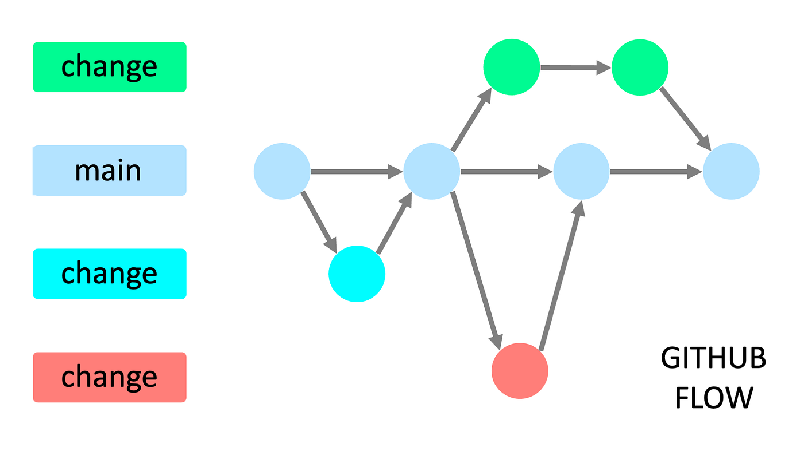

# Contributing Guidelines

Welcome to our development project for WoPeD! To ensure a smooth and efficient workflow for everyone involved, we follow a structured development process. Please adhere to the following guidelines when contributing.

## Create a new Branch 

Before starting any development work, create a new feature branch from the `main` branch. Never develop on the `main` branch itself. The feature branch name should follow this pattern:

```
feature/<short-description>
```

**Examples:**
- `feature/login-page`
- `feature/database-schema` 

## Commit to the Branch

### Commit Naming Convention (Moritz pls. adapt this chapter)

All commits should follow this convention to maintain clarity and traceability:

```
<type>: <concise description>
```

**Examples:**
- `feat: implement user login`
- `fix: correct typo in registration form`

Use the following types:
- `feat` – A new feature  
- `fix` – A bug fix  
... 

### Commit Hooks (Moritz pls. adapt this chapter)

To enforce consistency and code quality, we use Git hooks.

**Hooks in use:**
- `pre-commit`: Runs linting and formating before allowing a commit.  
- `commit-msg`: Verifies that the commit message adheres to our naming convention.  

## Create a Pull Request (Needs a revision by Jona & Leon)

Once your changes are complete and pushed to your feature branch:

1. Open a Pull Request (PR) against the `main` branch.
2. Ensure your PR fulfills all the requirements listed in the PR Template
5. Once approved, your PR can be merged.
